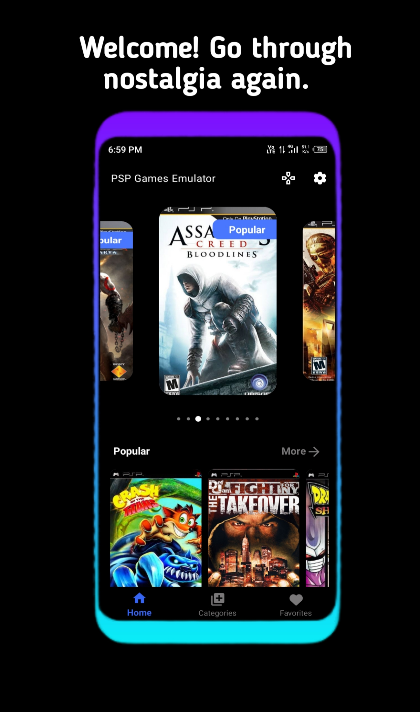
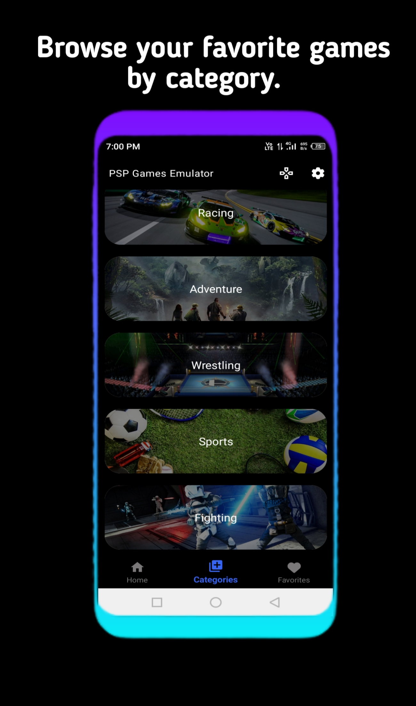
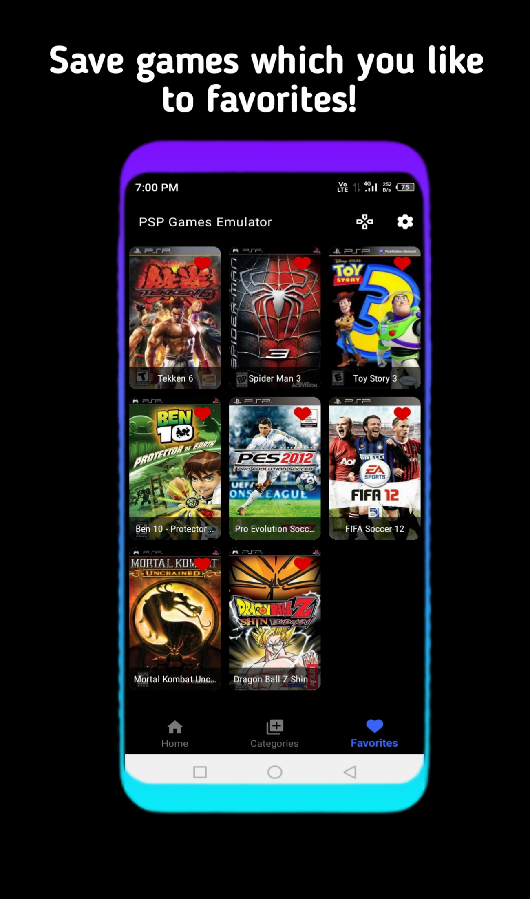
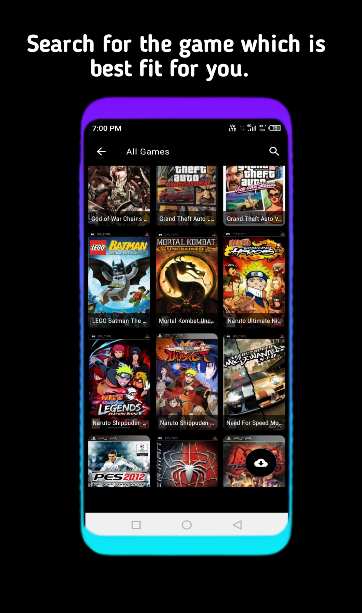
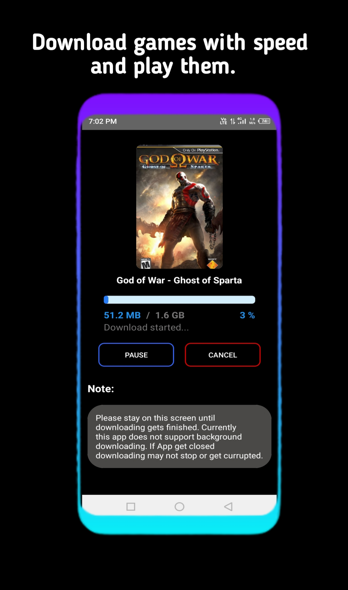
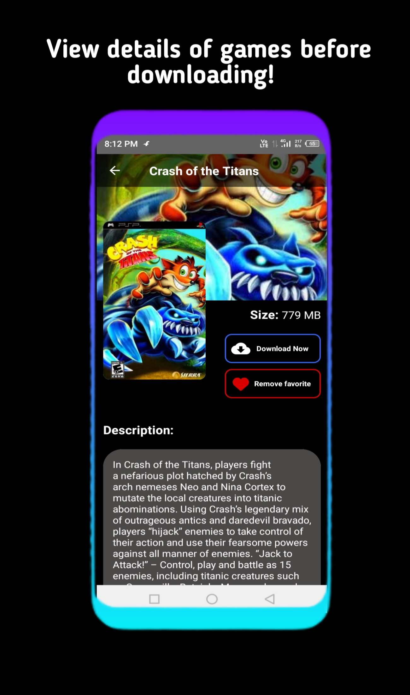
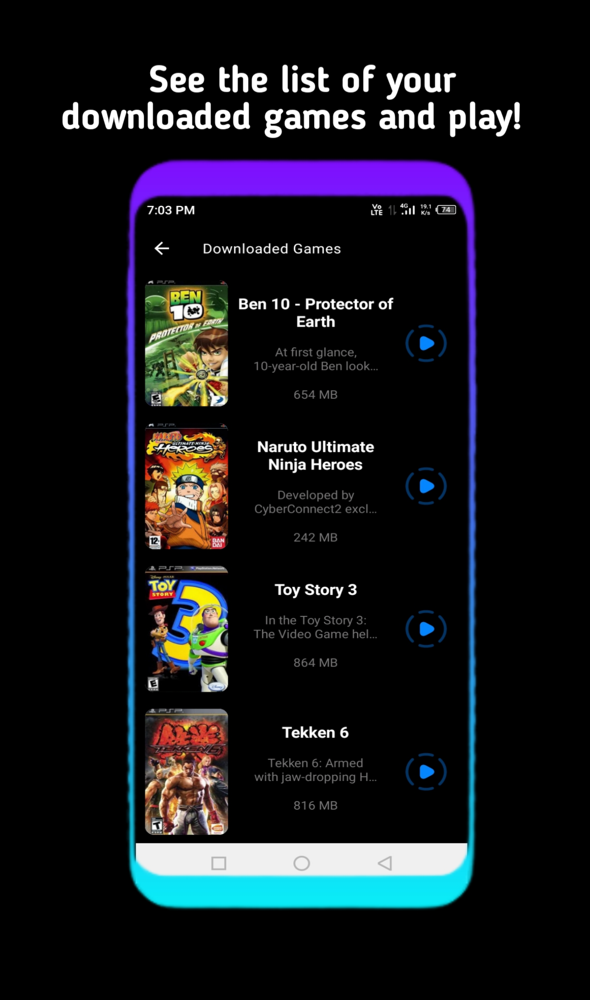
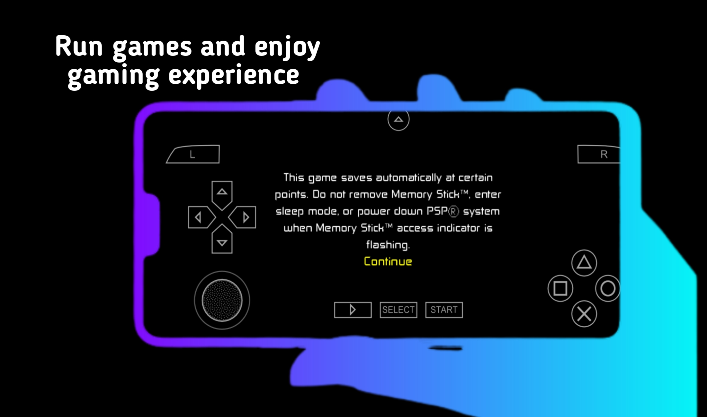

# 📱 My Apps Portfolio

Welcome! This repository showcases all the applications I have created so far. Each app includes its name, purpose, screenshots, and a download link.

---

## 📌 About This Repository

This repo serves as a **central portfolio** of my projects, making it easy for anyone to explore, understand, and download my apps.

* 🔹 Clear description of each app
* 🔹 Visual previews (screenshots)
* 🔹 Direct download links
* 🔹 Easy to extend as I build more apps

---

## 📂 Apps List

> 💡 **Tip:** Keep screenshots in an `assets/` or `screenshots/` folder for clean organization.

---

###  🚀 PSP Games Emulator

**Purpose:**
This is an PSP Games Emulator with Downloading functionality. In this app you can download games from database of app and also play them on your android device. Before downloading any game you can easily check its details like description, size, etc. Live through nostalgia while enjoying your favorite psp games on your mobile device.

**App Tech Stack:**

* Language / Framework: JAVA, XML, C++, C
* Backend : recyclerview, downloading implementation
* Database / Services: Room DB, retrofit, custom php api(for pulling data from backend), onesignal & firebase(for notification)

**Key Features:**

* Show psp games stored on server.
* Allow users to download games.
* Users can see there downloded games and play them
* when user try to play game app trigger emulator
* all images loaded using glide

**Screenshots:**

  
  
  
  
  
  
  
  

**Download:**
🔗 [Download PSP Games Emulator](https://example.com/download-link)

---

###  🚀 Food Delivery 

**Purpose:**
This the food delivery app like zomato. It's let users to sign up and login to there account than they can start ordering food. App use firebase for authentication of login-sign up. Its maded using jetpack compose, kotlin and follows clean code architecture (data, domain, presentation) with MVVM and dependency injection. 

**App Tech Stack:**

* Language / Framework: Kotlin, Jetpack Compose 
* Backend / UI (if any): Dagger hilt, MVVM, login and sign up with email password, Custom Responsive Uis, Navigation with Compose, etc. 
* Database / Services: Firebase integration. 
**Key Features:**

✅ 10+ UI screens with unique features
✅ Authentication using the email and password 
✅ Firebase Integrated
✅ Restaurant Listings
✅ Food Menus & Offers
✅ Search Functionality
✅ Custom UI Design
✅ Navigation with Compose
✅ Fully responsive layouts
✅ Modern UI Animation 

**Screenshots:**

**Download:**
🔗 [Download App Name 2](https://example.com/download-link)

---

## 🛠️ Tech Stack (Optional)

You can list technologies you commonly use:

* Frontend: React / Flutter / Android / iOS
* Backend: Node.js / Firebase / Django
* Database: MongoDB / SQLite / PostgreSQL

---

## 📬 Contact

If you’d like to collaborate or have questions:

* GitHub: [https://github.com/your-username](https://github.com/your-username)
* Email: [your-email@example.com](mailto:your-email@example.com)

---

⭐ If you like my work, consider giving this repository a star!
